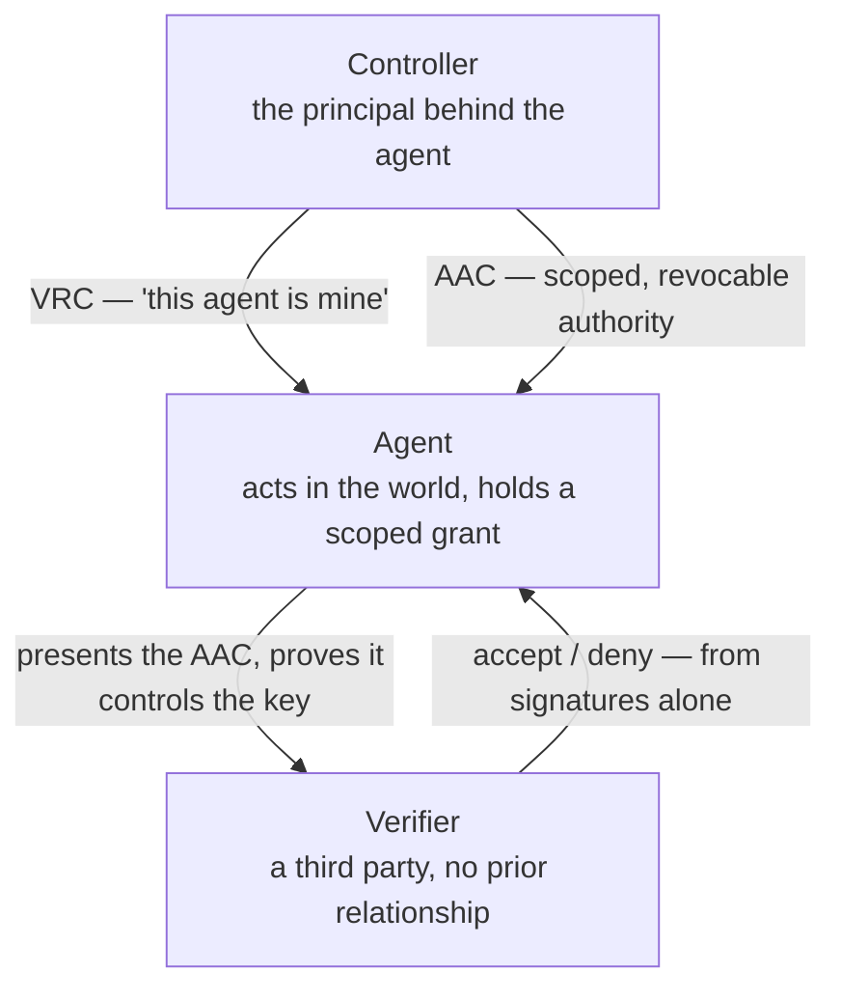
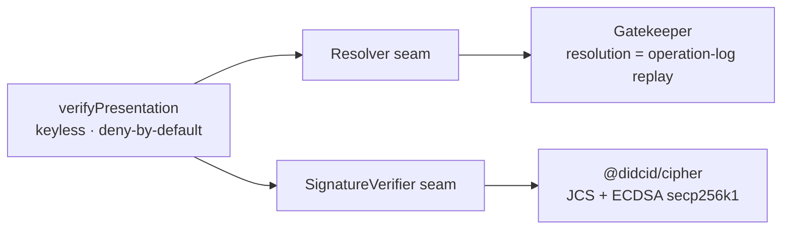

# Sigil

**Verifiable AI agent identity on [Archon](https://github.com/archetech/archon).**

Sigil is the agent-identity layer on top of Archon's decentralized identity, credential, and collaboration
primitives. It lets two AI agents from two organizations establish grounded, scoped, revocable trust — verifying,
*before an interaction begins*, **who an agent is, what entity controls it, and what it is authorized to do** —
with a signature, not a pre-existing bilateral agreement.

The work is aligned to the W3C [Agent Identity Community Group](https://www.w3.org/community/agent-identity/) and
to the growing demand for verifiable agent-to-agent (A2A) exchange.

## At a glance

Three actors, and trust that rests on signatures — not on a bilateral agreement set up in advance:



## Status

**v0 — present-and-verify and multi-hop delegation are implemented and verified end-to-end against a live Archon
node.**

The anchor is **present-and-verify**: an agent, with no prior relationship to the verifier, proves its identity,
the entity that controls it, and that a **specific** action is in scope — and the verifier accepts or denies from
signatures and DID resolution alone. **Delegation** extends this to a **multi-hop attenuated chain**: authority is
passed agent→agent by signed, narrowing grants, and the verifier walks the whole chain root→leaf **without
contacting any delegator** — the object-capability property. **Human step-up** requires a fresh proof-of-human
co-sign by the accountable principal for actions the verifier designates high-consequence (assurance
`human-co-signed`). All are traced Requirement → Design → Code → Test in [`TRACEABILITY.md`](TRACEABILITY.md).

New here? Read [`Requirements/sigil-v0-requirements.md`](Requirements/sigil-v0-requirements.md) for the thesis,
scope, actor model, and design principles; then [`docs/`](docs) for the design.

## What it does

Authority is a **signed, scoped, revocable capability object**, verified at the point of use — never a role or a
standing permission. Three layers:

- **Presentation** — a holder-bound presentation proving control of the agent DID against a fresh challenge (not
  bearer). See [`docs/presentation-model.md`](docs/presentation-model.md).
- **Control** — the agent↔controller binding is a referenced ToIP **DTG** Verifiable Relationship Credential (VRC),
  not the verifier's word. See [`docs/aac-dtg-reconciliation.md`](docs/aac-dtg-reconciliation.md).
- **Authorization** — a Sigil **Agent Authorization Credential (AAC)**: a capability credential referencing that
  VRC, carrying the scoped, attenuable, revocable authority. See [`docs/agent-credential.md`](docs/agent-credential.md).
- **Delegation** — authority passes agent→agent as a **multi-hop chain** of AACs that only *narrow* (monotonic
  attenuation); the verifier walks it root→leaf offline, contacting no delegator. See
  [`docs/delegation-chain.md`](docs/delegation-chain.md).
- **Invocation** — an agent *exercises* a capability as a signed, committed act, and a resource server returns a
  signed **receipt**; the invocation + receipt is an **attributable record** a third party can re-verify offline to
  attribute the action to the acting agent and the accountable principal. Completes the ocap lifecycle
  **mint → delegate → invoke → revoke**. See [`docs/invocation.md`](docs/invocation.md).
- **A2A exchange** — present-and-verify as a transport-agnostic protocol (request → challenge → presentation →
  result) that rides **Archon DIDComm** mailboxes, so two agents that have never met collaborate by DID. See the
  DIDComm profile in [`docs/presentation-model.md`](docs/presentation-model.md).
- **Trust levels** — the verifier *derives* an assurance level from what it can prove, and raises it from a
  decentralized **trust graph** (DTG endorsement / witness / membership from anchors it trusts) rather than a
  central list. See [`docs/trust-registry.md`](docs/trust-registry.md).
- **Correlation resistance** — an agent acts under a **persona** (a fresh DID per relationship), so counterparties
  can't correlate it; a signed persona-link (DTG VPC), kept out-of-band, is the *with-cause* recovery path. See
  [`docs/pairwise.md`](docs/pairwise.md).

Everything rests on the Archon substrate — resolution is operation-log **replay**, revocation is a `delete`, and
each signature is verified point-in-time against the signer's key state when it signed. See
[`docs/archon-substrate.md`](docs/archon-substrate.md).

## How it's built

Two seams, injected, so the logic is testable without a live node and the trust surface is minimal:



- **The verifier is keyless.** `verifyPresentation` ([`src/verify.ts`](src/verify.ts)) crosses a deny-by-default
  ladder using only two public dependencies — DID resolution and signature checking:
  - `createArchonResolver` ([`src/archon/resolver.ts`](src/archon/resolver.ts)) — wraps an Archon **gatekeeper**
    (`@didcid/clients`); resolution is operation-log replay, point-in-time via `versionTime`.
  - `createArchonSignatureVerifier` ([`src/archon/signatures.ts`](src/archon/signatures.ts)) — wraps
    **`@didcid/cipher`** (JCS canonicalization + ECDSA secp256k1); it verifies exactly what Archon signs.

  It never uses a keymaster/wallet — a verifier needs no secret, which is also what lets it run offline against
  cached resolutions.

- **The issuer self-custodies.** Minting needs signing, so `createArchonIssuer`
  ([`src/archon/issuer.ts`](src/archon/issuer.ts)) holds its **own** keys and submits `create`/`update`/`delete`
  operations straight to the gatekeeper — mint an agent, a VRC, an AAC; present; revoke. Also no keymaster/wallet.

## Build & test

Requires **Node ≥ 22.18** (ESM, strict TypeScript, `.ts` imports run via `node --experimental-strip-types`).

```bash
npm install
npm run typecheck        # tsc, including tests
npm test                 # unit tests — offline, hermetic (the CI gate)
```

Two **opt-in** live suites run the adapters against a real Archon node. Configure entirely by environment — no
hostname or secret is committed (see [`.env.example`](.env.example)); `SIGIL_GATEKEEPER_URL` defaults to a public
node.

```bash
# resolve real DIDs through a live gatekeeper (operation-log replay)
SIGIL_GATEKEEPER_URL=<url> npm run e2e:archon -- did:cid:...

# the whole anchor, live: mint → present → verify → out-of-scope deny → revoke → teardown
SIGIL_GATEKEEPER_URL=<url> npm run e2e:prove

# a multi-hop delegation chain, live: mint controller→a0→a1→a2 → present → walk root→leaf → teardown
SIGIL_GATEKEEPER_URL=<url> npm run e2e:delegate
```

## Interactive demo

[`demo/`](demo) is a small web app to **build a delegation chain and verify it** step by step, watching Sigil
accept or deny in real time. It drives the *real* library (`createArchonIssuer`, `verifyPresentation`) — no mock
logic — offline in your browser by default, or against a live node. See [`demo/README.md`](demo/README.md).

```bash
cd demo && npm install && npm run dev
```

## Repository layout

```
src/
  index.ts            public surface
  types.ts            AAC / VRC / Presentation / the Resolver + SignatureVerifier seams
  verify.ts           verifyPresentation / verifyInvocation / verifyRecord (keyless); derives assurance
  capability.ts       attenuates — the monotonic-attenuation rule (AC-8), shared by issuer + verifier
  transport.ts        the Transport seam + an in-memory network (offline)
  protocol.ts         the A2A exchange: request → challenge → presentation|invocation → result|receipt
  archon/
    resolver.ts       createArchonResolver        — gatekeeper resolution (replay, point-in-time)
    signatures.ts     createArchonSignatureVerifier — @didcid/cipher (JCS + ECDSA secp256k1)
    issuer.ts         createArchonIssuer          — mint / delegate / invoke / receipt / persona / revoke; self-custodied, optional HD-seed recovery
    transport.ts      createArchonTransport       — the protocol over Archon DIDComm mailboxes
test/                 node:test — verify · archon · issuer · delegation · step-up · trust-registry · invocation · protocol
scripts/              e2e-archon-{resolve,prove,delegate,stepup,invoke,didcomm}.ts (opt-in, live node)
docs/                 substrate, archon-primitives, keymaster-account, schemas, presentation, agent-credential, delegation, invocation, trust-registry, …
schemas/              aac.schema.json — Sigil's own AAC schema (trust-graph creds reference DTG's)
demo/                 interactive web app (Vite) — build a chain and verify it, offline or live
Requirements/         actor-first requirements (start with sigil-v0-requirements.md)
tools/trace/          the traceability-matrix generator
TRACEABILITY.md       generated Requirement → Design → Code → Test matrix
```

## Contributing

- [`CONTRIBUTING.md`](CONTRIBUTING.md) — the issue → PR → merge flow (issues cite requirement IDs; acceptance
  criteria are the `Verify:` lines; PRs keep the trace in sync).
- [`AGENTS.md`](AGENTS.md) — working rules for coding agents and the running lessons-learned log.
- [`docs/traceability.md`](docs/traceability.md) — the four-layer Requirement → Design → Code → Test trace and its
  generated [`TRACEABILITY.md`](TRACEABILITY.md) matrix.
- [`docs/ci-and-testing.md`](docs/ci-and-testing.md) — the staged CI gate and the unit-vs-live-node split.
- [`SECURITY.md`](SECURITY.md) — responsible disclosure.

## Governance & license

Sigil is a project under the [Archonomicon](https://github.com/archetech/archonomicon), the Archetech Nomicon —
its decisions are made and recorded through that process, alongside Archon. Changes to project *rules* go through a
Nomicon proposal; code and design changes follow [`CONTRIBUTING.md`](CONTRIBUTING.md).

Licensed under the [MIT License](LICENSE).
