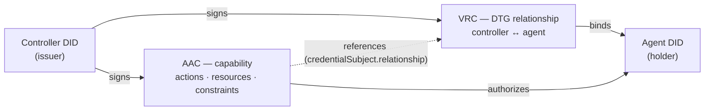

# Sigil Agent Credential

**Status:** design note, v0 · the credential the anchor use-case presents and verifies.
Requirements captured in [`Requirements/agent-credential.md`](../Requirements/agent-credential.md).

> **Updated by [`aac-dtg-reconciliation.md`](aac-dtg-reconciliation.md):** the control binding is a *reference to a
> ToIP DTG **VRC*** (a verifiable relationship credential), not the issuer alone — see §2, §3.2, §6. The AAC is
> Sigil's *capability* layer riding on the DTG trust graph.

## 1. What it is

The **Agent Authorization Credential (AAC)** is the artifact at the centre of Sigil. It is a W3C Verifiable
Credential that answers, in one signed object, the three questions a relying party must resolve before it acts:

| Question | Answered by |
|---|---|
| **Who is this agent?** | the credential *subject* (`credentialSubject.id`) — the agent's DID, method-agnostic |
| **What entity controls it?** | the *issuer* (canonically the controller) + an explicit `controller` claim |
| **What may it do here?** | the `authorization` scope claim |

Two distinct proofs bind it, and they must not be conflated:
- **Controller binding** — the *issuer's signature* over the credential. The signer is the accountable controlling
  entity. (Answered once, at issuance.)
- **Holder binding** — the agent, at presentation, *proves control of `credentialSubject.id`'s key* against the
  verifier's nonce (the challenge/response of [`presentation-model.md`](presentation-model.md)). The credential is
  **not bearer**: holding the bytes is not enough.

The AAC does not assert control itself — it **references** a DTG VRC that does, so relationship and capability keep
their own lifecycles:



## 2. Structure

A concrete `ldp_vc` (JSON-LD, W3C VCDM 2.0) example — the encoding that maps directly to Archon's native VP:

```json
{
  "@context": [
    "https://www.w3.org/ns/credentials/v2",
    "https://sigil.archetech.org/ns/agent/v1"
  ],
  "type": ["VerifiableCredential", "AgentAuthorizationCredential"],
  "issuer": "did:web:acme.example",
  "validFrom": "2026-09-01T18:00:00Z",
  "validUntil": "2026-09-01T19:00:00Z",
  "credentialStatus": {
    "type": "SigilRevocation2026",
    "id": "did:cid:baga…status"
  },
  "credentialSubject": {
    "id": "did:cid:baga…agentA",
    "relationship": "did:cid:baga…vrc",
    "assuranceLevel": "org-vouched",
    "authorization": {
      "actions": ["invoke:catalog.search", "read:catalog.item"],
      "resources": ["did:web:vendor.example/catalog"],
      "constraints": {
        "audience": ["did:web:vendor.example"],
        "maxInvocations": 100,
        "notAfter": "2026-09-01T19:00:00Z"
      },
      "delegable": true,
      "parent": null
    }
  },
  "proof": { "…": "issuer (controller) signature" }
}
```

### Field decisions

- **`issuer` = a party to the referenced relationship.** Canonically the controller; the issuer signs the
  *capability grant*. The control binding itself is the verified DTG **VRC** referenced below — not the issuer
  signature alone (see [`aac-dtg-reconciliation.md`](aac-dtg-reconciliation.md)).
- **`credentialSubject.relationship`** — a reference to the DTG **VRC** that establishes controller↔agent. The
  controller is **read from the VRC**, not re-asserted here; the AAC `issuer` MUST be a party to it. A witnessed or
  third-party relationship uses DTG **VWC** rather than a bespoke attestation profile.
- **`credentialSubject.id`** — the agent's DID. May be `did:cid`, `did:web`, `did:key`, … (method-agnostic, per
  `presentation-model.md` §5). The holder proves control of *this* key at presentation.
- **`authorization`** — the scope, as a structured, attenuable object:
  - `actions` / `resources` — what may be done, to what. Namespaced strings and DIDs, not free text.
  - `constraints` — `audience` (which verifier(s) may accept it — binds the presentation target), plus caveats
    such as `maxInvocations`, `notAfter`, rate, or context limits.
  - `delegable` — **advisory** delegation policy, not a hard gate: `false` means "please don't delegate onward",
    honored by convention and kept in the chain for audit, but it never blocks a still-attenuating delegation or
    its verification (blocking delegation is an anti-pattern — see [`delegation-chain.md`](delegation-chain.md) §5).
  - `parent` — for delegation chains: the capability this one narrows. `null` at the root (issued by the
    controller). A delegated AAC's `authorization` MUST be a subset of its `parent`'s (monotonic attenuation).
- **`validFrom` / `validUntil`** — short-lived by default (minutes–hours), for lifecycle hygiene; re-issue rather
  than long-live.
- **Revocation** — a **`delete` operation** on the credential's DID (→ `deactivated: true`), seen by *replaying*
  the DID; there is no separate status list (see [`archon-substrate.md`](archon-substrate.md)). It is
  **irreversible** — use short validity + re-issue for temporary suspension. Verification is **fail-closed**: a
  deactivated or unresolvable credential ⇒ deny. (A holder's manifest `reveal: false` un-publishes a credential —
  disclosure control, distinct from revocation.)
- **`assuranceLevel`** — the trust level (see §5), seeded from what the issuance actually proved.

## 3. The three bindings, precisely

1. **Identity (agent ↔ key).** `credentialSubject.id` names the agent; the *holder binding* proof at presentation
   demonstrates the presenter controls that DID's key. Neither the credential alone nor the DID alone suffices —
   the live proof against the verifier's nonce is what authenticates the agent.
2. **Control (agent ↔ controller).** Established by the referenced DTG **VRC**: the verifier resolves and verifies
   the VRC (signed, not revoked, establishes controller↔agent) and confirms the AAC `issuer` is a party to it. The
   VRC — not the AAC issuer alone — is the accountability the CG requires.
3. **Authorization (agent ↔ scope).** `authorization` states exactly what the agent may do; the verifier evaluates
   it against the *specific* action requested, refusing anything outside it. Scope is verified **at the point of
   use**, never assumed from the mere presence of a credential.

## 4. Lifecycle — on Archon rails

The AAC rides the issue → deliver → hold → present → verify path already provided by Archon (see
`presentation-model.md`), including to non-native agents. The keymaster verbs below are the API over Archon DID
operations: *issue* ≈ `create` the credential asset DID (issuer-signed); *hold/accept* ≈ `update` the holder
agent's `manifest`; *revoke* ≈ `delete` (see [`archon-substrate.md`](archon-substrate.md)).

1. **Issue.** The controller mints the AAC as an asset DID over its agent's DID (Archon `bindCredential` /
   `issueCredential`), signing as the controlling entity.
2. **Deliver.** The controller sends it over DIDComm (`send_credential_didcomm`) to the agent — which MAY be
   `did:web` (resolved via the gatekeeper's universal-resolver fallback), delivered to the agent's mailbox / via a
   mediator.
3. **Hold.** The agent accepts and holds the AAC (`accept_credential_didcomm`).
4. **Present.** On contact, the verifier issues a challenge (`credentials: [{ schema: AAC-schema, issuers: [trusted
   controllers…] }]`, plus nonce + `domain`); the agent responds with a VP carrying the AAC + holder proof.
5. **Verify.** The verifier runs §6.

## 5. Trust levels (seed)

Archon's three challenge types seed an assurance ladder carried in `assuranceLevel`:

| Level | Meaning | Proved at issuance/presentation |
|---|---|---|
| `identity` | the agent controls its DID | holder proof only (no AAC required) |
| `controller-vouched` | a controller signed the agent's authority | AAC present, issuer signature verifies |
| `issuer-pinned` | the controller is one the verifier trusts *a priori* | root issuer ∈ verifier's pinned set, or a `VMC` membership from a trusted registry |
| `endorsed` / `witnessed` | a trusted anchor vouches for / witnesses the controller | a `VEC` / `VWC` about the root issuer, signed by a verifier-trusted anchor |
| `human-co-signed` | a proof-of-human step-up co-signed the authority | AAC + a fresh principal co-sign (high-consequence) |

The verifier **derives** this level from what it can prove — it never accepts the level a credential asserts. The
root-of-trust machinery for the middle rungs is [`trust-registry.md`](trust-registry.md) (TR-1…TR-5).

**Human step-up (AC-11).** When the verifier designates the requested action *high-consequence*, the AAC alone is
not enough: the presentation MUST carry a **co-sign** — a fresh signature by the **accountable principal** (the
root's controller) over the *exact* request (`{authorizer, challenge, audience, action, resource}`). Because it is
bound to the challenge and the specific action, a standing capability cannot satisfy it and the co-sign cannot be
replayed onto another action; it is verified point-in-time like any signature and, on success, lifts the
presentation to `human-co-signed`. The *human* property is key custody — the authorizer key is held by a human 2nd
factor — so the verifier requires a fresh principal signature at the point of use, not merely a prior grant. A
distinct *designated-authorizer* DID (separate from the controller) is a future refinement.

Key-type interop (`presentation-model.md` §5) modulates this: a presentation whose foreign key type Archon can
fully verify rates higher than one it can only partially check — surfaced explicitly, never failed opaquely.

## 6. Verification algorithm (what the verifier checks)

Given a presented VP for a requested action `A` on resource `R`, with verifier audience `V` and challenge nonce
`N`, the verifier MUST confirm **all** of:

1. **Holder binding** — the VP proof shows the presenter controls `credentialSubject.id`, bound to `N` and `V`.
2. **Relationship (control)** — the referenced DTG **VRC** resolves and verifies (signed, establishes
   controller↔agent, not revoked), and the AAC `issuer` is a party to it.
3. **Trust** — the issuer/relationship satisfies the verifier's trust requirement for this interaction (§5).
4. **Authorization** — `A ∈ authorization.actions` **and** `R ∈ authorization.resources` **and** all
   `constraints` hold (incl. `V ∈ constraints.audience`).
5. **Validity** — `now ∈ [validFrom, validUntil]`.
6. **Revocation** — resolve (replay) the AAC's DID **and** the referenced VRC's DID; neither is `deactivated` (a
   `delete`). A `delete` on the VRC invalidates every AAC referencing it. *Deactivated or unresolvable ⇒ deny.*
7. **(If delegated)** — walk `parent` to the root; each hop's `authorization ⊆ parent.authorization`; no hop
   revoked. *Any break ⇒ deny the whole chain.*

Failure of any check is a **deny**, with a reason the requester can act on but that discloses no more than needed.

## 7. Delegation (extension — later slice)

The anchor is single-hop (controller → agent). Sub-delegation (UC-2) reuses the same AAC shape: a delegating agent
issues a child AAC whose `authorization ⊆` its own and whose `parent` points at the capability it narrows.
Widening MUST be refused at issuance and is unrepresentable in a verified chain (monotonic attenuation).
Revocation is per-hop and fail-closed. The credential model is designed for this now so the chain case needs no
new structure — only chain-walking at verification (§6.7).

## 8. Open questions
- **Scope vocabulary.** Namespacing for `actions`/`resources` — a Sigil-defined scheme, or align to an existing
  one (OAuth scopes, GNAP, UMA, ZCAP-LD caveats)? ZCAP-LD is the closest prior art for attenuable capabilities.
- **`authorization` as claim vs. as a linked capability.** Inline (above) is simplest for the anchor; a linked
  ZCAP/object-capability may serve delegation better. Decide before UC-2.
- **Revocation mechanism.** `credentialStatus` type — status list, per-credential revocation DID, or Archon-native
  `revokeCredential`? Must be fail-closed and cheap to check at the point of use.
- **Third-party attestation profile.** Exact shape when `issuer ≠ controller`.
- **`assuranceLevel` — asserted vs. derived.** Should the level be a claim the issuer asserts, or purely derived by
  the verifier from what it can check? (Leaning derived, to avoid a self-asserted trust level.)
- **Schema registration.** Register the AAC type as an Archon schema (a schema DID) so challenges can name it in
  `credentials[].schema`.

## Traceability

Design points (convention: [`traceability.md`](traceability.md)); each realizes the requirement(s) after the arrow:

- `[D-AAC-1 → AC-1, AC-2]` §1 — two distinct bindings (issuer signature = control; holder proof = identity); the credential is **not bearer**.
- `[D-AAC-2 → AC-3]` §2, §3.2 — control binding via a referenced DTG VRC (the AAC issuer is a party to it).
- `[D-AAC-3 → AC-4, AC-6]` §2 — structured, attenuable `authorization` (actions / resources / constraints incl. `audience`).
- `[D-AAC-4 → AC-7]` §2, §6 — short validity + fail-closed revocation status.
- `[D-AAC-5 → AC-9]` §2, §4 — method-agnostic subject / controller / issuer (`did:web` first-class).
- `[D-AAC-6 → AC-10]` §5 — assurance-level ladder, derived from what was proved.
- `[D-AAC-7 → AC-5]` §3.3, §6.4 — authorization verified at the point of use.
- `[D-AAC-8 → AC-11]` §5 — proof-of-human step-up for high-consequence actions.
- `[D-AAC-9 → AC-12]` §6 — deny with minimal disclosure.
- `[D-AAC-10 → AC-8]` §7 — delegation by monotonic attenuation; chain-walk verification.
