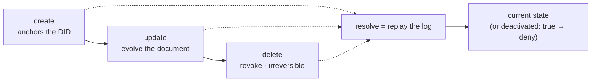

# Archon Substrate

**Status:** foundational reference · the Archon identity model Sigil builds on. Sigil's credentials, relationships,
and revocation are all expressed in these primitives; the design notes assume this model. Source: the
[did:cid specification](https://archetech.com/didcid-specs).

## Operations — the whole grammar of change

Every DID is an **ordered log of signed operations**, each operation content-addressed by a CID and linked to the
prior one by `previd`. There are exactly three:

| Operation | Fields | Meaning |
|---|---|---|
| **`create`** | `registration.{version,type,registry}` (`type` = `agent`\|`asset`), `publicJwk` (agents) or `controller`+`data` (assets), `created`, `proof` | Anchors a new DID. Its CID **is** the DID identifier. |
| **`update`** | `did`, `doc`, `previd`, `proof` | Evolves the document; signed by the controller. |
| **`delete`** | `did`, `previd`, `proof` | Deactivates the DID (`didDocumentMetadata.deactivated = true`). **Irreversible** — no recovery op exists. |

The DID identifier is `did:cid:<cid>`, where `<cid>` is the **CIDv1-base32 of the JCS-canonicalized create seed** —
so the identifier is a content hash of its own genesis (the anchor).

There is no stored document: resolution **replays** the log to derive current state, and a `delete` makes every
future resolution deny.

## Objects — agents sign, assets hold

- **Agent** — has `verificationMethod` (keys), `authentication`, `assertionMethod`. Agents *sign* operations and
  credentials.
- **Asset** — has a `controller` (an agent DID) and `didDocumentData`; **no keys**. Assets *hold data* and are
  governed by their controlling agent.

**A credential is an asset.** It is *held* by being listed in the holder **agent's** `didDocumentData.manifest`:
each entry keys the credential's DID to a **disclosure mode** — `reveal: true` (the full credential is published)
or `reveal: false` (existence only). Credentials are added by ordinary `update` ops on the holder's DID. The
keymaster verbs (`issueCredential` / `bindCredential` / `acceptCredential`) are the API over these operations:
*issue* ≈ `create` the credential asset (issuer-signed); *accept/hold* ≈ `update` the holder's manifest.

A Sigil/Archon VC therefore involves **four DIDs**: the credential's own **VC-DID** (the asset), its **issuer**
DID, the **recipient** DID (`credentialSubject.id`, the agent), and the **schema** DID (the credential `type`).

## Resolution — replay, not fetch

There is **no stored "resolved document."** A resolver reconstructs a DID document by **replaying its operations in
order at resolution time**, validating each `proof`. This has two consequences Sigil relies on:

- **Offline + delegator-independent.** Operations are content-addressed and published to the registry, so any
  party can fetch the CIDs and replay locally — no live contact with the DID's controller. This is the substrate
  that makes the offline delegation-chain proof ([`delegation-chain.md`](delegation-chain.md)) native, not bolted-on.
- **Point-in-time resolution is formal.** A resolution may be pinned with `versionTime` (ISO 8601 — "at or before"),
  `versionSequence` (1-indexed op number), or `versionId` (a specific op CID). This is what lets a verifier check a
  delegation against the signer's key state *as of when it signed*, so key rotation never invalidates a valid past
  delegation.

## Revocation — the `delete` operation, irreversible

**Revocation is a `delete` operation** on the credential's (or relationship's) DID. Replay then yields a minimal
document with `deactivated: true`; a verifier resolving it MUST **fail closed** (deny). It is **irreversible** —
once `delete` is confirmed on the registry there is no controller left to sign a recovery. Consequences for Sigil:

- **Temporary suspension MUST use short validity + re-issue**, never `delete`.
- **Disclosure is a separate, reversible lever:** a holder setting `reveal: false` in its manifest un-publishes a
  credential (existence-only) without revoking it — correlation/disclosure control, not revocation.

## How Sigil maps onto it

Every Sigil credential — the **AAC**, and the DTG **VRC / VPC / VWC / VEC** — is an Archon **asset DID** with a
`create → update → delete` lifecycle: resolvable at any point in time by replay, revoked (irreversibly) by
`delete`, and disclosed under the holder's manifest control. Nothing in Sigil's model requires a primitive Archon
does not already provide.

## Live adapters — what the verifier actually depends on

The reference verifier ([`src/verify.ts`](../src/verify.ts)) reaches Archon through two injected seams, each with
a live adapter:

- **Resolution** → `createArchonResolver` ([`src/archon/resolver.ts`](../src/archon/resolver.ts)) wraps an Archon
  **gatekeeper** (`@didcid/clients` `GatekeeperClient`, or any `resolveDID(did, {versionTime|versionId})`). It maps a
  replayed `DidCidDocument` to the substrate model: verification methods → an agent's keys; `didDocumentData` → an
  asset's held credential; `didDocumentMetadata.deactivated` → revoked. A throw becomes `undefined` (fail-closed).
- **Signature verification** → `createArchonSignatureVerifier` ([`src/archon/signatures.ts`](../src/archon/signatures.ts))
  wraps **`@didcid/cipher`**: the canonical bytes are `hashJSON` = SHA-256 of the JCS (RFC 8785) canonicalization of
  the proof-less object, and the check is ECDSA secp256k1 over `proofValue` (base64url of the compact-hex signature) —
  the exact `EcdsaSecp256k1Signature2019` suite the substrate signs with, reused rather than re-implemented.

**The verifier is keyless by construction.** Both dependencies are public: resolution needs no secret, and verification
uses only the signer's *public* key (from the resolved DID document). A verifier therefore **never uses a keymaster** —
a keymaster is the wallet, needed only on the seams that hold secrets (an issuer minting an AAC, a holder signing a
presentation, a controller issuing a `delete` to revoke). Keeping the wallet off the verifier is the smaller trust
surface and is what lets a verifier run offline against cached resolutions.

Per-signature keys are resolved point-in-time at `proof.created` (`versionTime`), so a later key rotation or `delete`
does not retroactively invalidate a proof that was valid when signed; liveness/revocation is resolved at *now*.

## The issuer / holder seam

Minting the credentials the verifier consumes needs signing, so it is a separate seam — `createArchonIssuer`
([`src/archon/issuer.ts`](../src/archon/issuer.ts)). It mirrors Sigil's object-capability ethos: the issuer holds
its **own** keys (`@didcid/cipher`) and submits create/update/delete **operations** straight to the gatekeeper —
no keymaster/wallet. An agent, a controller, and each credential is a DID this process builds and signs itself:

- `mintAgent` — a self-custodied agent DID (a `create` operation carrying `publicJwk`, self-signed).
- `mintRelationship` — a DTG VRC as a controller-signed **asset** (the control edge).
- `mintAuthorization` — an AAC as a controller-signed asset. Because a credential's DID content-addresses its data,
  the AAC's own `id` can only equal its DID *after* creation — the one place a create-then-update backfill is
  unavoidable.
- `present` / `revoke` — a holder-signed presentation; a `delete` operation (irreversible).

`npm run e2e:prove` runs the whole loop — mint → present → `verifyPresentation` → revoke — against a live node.

## Traceability

- `[D-AS-1 → AC-7]` — revocation is the `delete` operation (deactivated, irreversible, seen by replay, fail-closed);
  no separate status list.
- `[D-AS-2 → DC-5, R8]` — versioned resolution (`versionTime`/`versionId`) enables per-hop key-state verification.
- `[D-AS-3 → R8]` — content-addressed operation-log replay is the offline, delegator-independent substrate.
