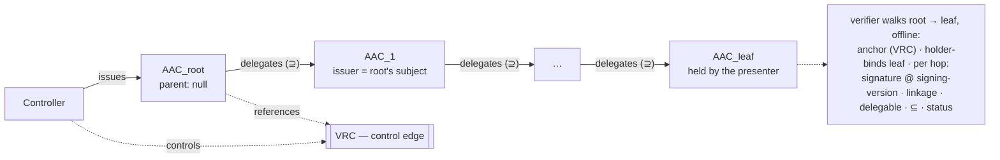

# Sigil Delegation Chain

**Status:** design note, v0 · how a multi-hop delegation is proven to a verifier **without contacting any
delegator live** (closes R8). Requirements in [`Requirements/delegation-chain.md`](../Requirements/delegation-chain.md).
Builds on the capability model in [`agent-credential.md`](agent-credential.md) and the AAC↔VRC anchoring in
[`aac-dtg-reconciliation.md`](aac-dtg-reconciliation.md).

## 1. The chain

Authority flows from a controller to a leaf agent through zero or more delegations, each a capability that *only
narrows*:

Each hop is an **AAC** (no new credential type — delegation reuses the capability credential):

- **`AAC_root`** — issued by the controller, references the establishing **VRC** (control), `parent: null`.
- **`AAC_i`** (a delegation) — `issuer` = the delegating agent (i.e. `AAC_{i-1}.credentialSubject.id`); `subject` =
  the sub-agent; `authorization` ⊆ its parent's; `parent` = a reference to `AAC_{i-1}`.
- **`AAC_leaf`** — its `subject` is the agent that presents, and proves holder control of, the chain.

## 2. Offline verification — the R8 property

The agent presents the **complete ordered chain** `[AAC_root … AAC_leaf]` inside one holder-bound presentation. For
a requested action `A`/`R`, audience `V`, nonce `N`, the verifier confirms **all** of, walking root→leaf:

1. **Leaf holder binding** — the presenter controls `AAC_leaf.credentialSubject.id`, bound to `N` and `V`.
2. **Root anchoring** — `AAC_root.parent == null`; its referenced **VRC** verifies (establishes controller↔root
   agent, not revoked); `AAC_root.issuer` is the controller / a party to the VRC.
3. **Linkage** — for each `i > 0`: `AAC_i.issuer == AAC_{i-1}.credentialSubject.id` **and** `AAC_i.parent`
   references `AAC_{i-1}`. (The delegator of a hop is the subject of its parent.)
4. **Signature (at signing version)** — each hop's `issuer` signature verifies against the delegator's key state
   **as of when it signed** — resolve the issuer DID at the hop's signing version (`versionTime` / `versionId`; see
   [`archon-substrate.md`](archon-substrate.md)), by replaying its operation log, not by consulting the delegator.
   A later key rotation therefore never invalidates a validly-signed past delegation.
5. **Attenuation** — each `AAC_i.authorization ⊆ AAC_{i-1}.authorization` (monotonic; see `agent-credential.md`
   AC-8). Any widening ⇒ deny. There is **no delegability gate**: a parent's `authorization.delegable` is advisory
   policy carried for audit, not a block (see §5).
6. **Authorization at the leaf** — `A`/`R` ∈ `AAC_leaf.authorization`, within all constraints (incl. `V ∈ audience`).
7. **Validity + status** — every hop is within validity and its status (and the VRC's) resolves and is not
   revoked. **Any revoked hop ⇒ deny the whole chain**, fail-closed.

**What makes it offline (R8):** every step above is decided from *the presented credentials* plus two standard,
delegator-independent lookups — **DID resolution** (public keys) and **status resolution** (revocation). **No hop
is ever contacted for approval.** A delegator "speaks once" when it signs its delegation; its signature *is* the
trust (P5), and it need not be online at verification time.

## 3. Anchoring — where the chain is pinned

- **Root** — pinned to the controller by a DTG **VRC** (accountability; `aac-dtg-reconciliation.md`).
- **Leaf** — pinned to the presenting agent by the holder-binding proof (identity; `presentation-model.md`).
- **Middle hops** — pinned by signatures alone; they carry no live obligation. This is exactly the
  object-capability property: authority is transferred by a signed, attenuated grant, verifiable after the fact.

## 4. Representation decision — VC-native, ZCAP-inspired

A delegatable, attenuable, offline-verifiable capability chain is precisely what **ZCAP-LD** (Authorization
Capabilities for Linked Data) models. Sigil **aligns to ZCAP-LD's concepts** — root capability, delegation with
caveats/attenuation, invocation proof — but **expresses the chain in the W3C VC data model** (parent-linked AACs)
rather than adopting ZCAP-LD's separate document + invocation machinery. This keeps Sigil coherent with its other
choices (VC + DTG + OID4VP), and the R8 property holds either way. *This resolves the earlier "capability inline
vs. linked ZCAP-LD" open item toward a VC-native, ZCAP-inspired chain; a future ZCAP-LD interop profile remains
open.*

## 5. Delegation is not blocked — an anti-pattern avoided

Sigil deliberately has **no `do-not-delegate` gate, no depth cap for authority reasons, and no delegate-target
restriction**. Blocking delegation is a security anti-pattern (A. Karp, *"Blocking Delegation is an Anti-pattern"*,
IETF SPKI RFC 2693 being the classic offender): a hard block does not stop authority reaching a sub-agent — the
holder can always **proxy** (act on the sub-agent's behalf with its own key) — it only makes that onward use
*unaccountable*, couples availability to the holder, and defeats least-privilege (the holder's *full* authority is
exercised, not the sub-agent's slice). It also breaks encapsulation: the issuer would have to predict the future
org/task shape to set a correct limit.

Sigil bounds authority the accountable way instead:

- **Monotonic attenuation** (`AC-8`) — a delegation can only *narrow*; onward delegation never grants more.
- **Constraints** — `audience`, `notAfter`, `maxInvocations` ride the capability and attenuate with it.
- **Per-hop revocation** + the **audit chain** (`R11`) — every hop is attributable and independently killable.
- **`delegable` is advisory** — `false` means "please don't delegate onward"; it is honored by convention and left
  in the chain for audit, but is never a verification or issuance gate. (A richer signed `delegationPolicy` — and
  the "guide, don't block → request justification → log → refine" control-plane loop — is a future extension.)

## 6. Open items

- **Chain length bounds** — a verifier MAY cap depth / total credential size, but strictly as a **resource / DoS
  control, never an authorization control** (a depth limit is not a security boundary — see §5); keep any cap
  generous and policy-driven.
- **Cross-method chains** — hops on different DID methods (`did:web` delegating to `did:cid`); resolution is
  method-agnostic (per `presentation-model.md` §5), but confirm signature interop across the chain.
- **Presentation encoding** — how the ordered chain rides one VP token (an array in the `vp_token` / DIDComm
  present-proof); pin when profiling.
- **Revocation cost** — status resolution is per-hop; consider status aggregation for long chains.

## Traceability

- `[D-DC-1 → DC-1, R8]` §2 — offline chain verification; no live delegator contact.
- `[D-DC-2 → DC-2]` §2 — the complete ordered chain is presented (missing hop ⇒ deny).
- `[D-DC-3 → DC-3]` §3 — root anchored to the controller/VRC; leaf holder-bound.
- `[D-DC-4 → DC-4, R6]` §2, §5 — linkage (each hop issued by its parent's subject, referencing the parent); no
  delegability block (`delegable` is advisory, not a gate).
- `[D-DC-5 → DC-5, R8]` §2 — verify each hop against the signer's key state at its signing version (point-in-time
  resolution); revocation checked current.
