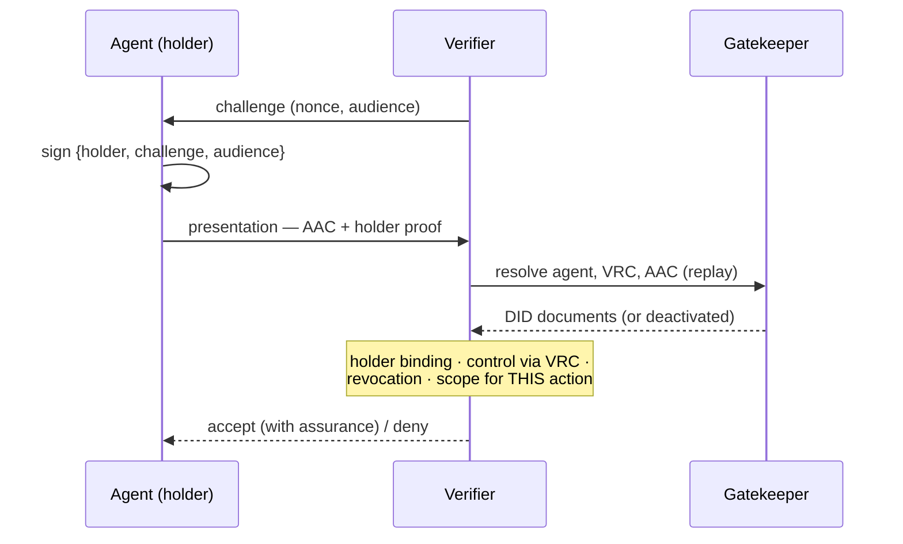

# Sigil Presentation Model

**Status:** design note, v0 · informs the anchor use-case (present → verify) and the W3C AICG "integration
profiles" deliverable.
Sources verified 2026-09-01 against the live specifications cited below.

## 1. The question

An agent must present, to a relying party it has never met, three things at once — **who it is**, **what entity
controls it**, and **what it is authorized to do** — and the relying party must verify all three before acting.
Every ecosystem the W3C Agent Identity CG lists (MCP, A2A, OAuth/OIDC, SPIFFE) has *some* presentation mechanism.
This note asks whether there is a common pattern to adopt, and how Archon's native challenge/response maps onto
the industry-standard expression of it.

The single-hop exchange, end to end:



## 2. Three paradigms, not five protocols

The listed technologies reduce to three presentation shapes:

1. **Bare bearer** — possession of a token *is* authorization. *Plain OAuth access tokens, OIDC ID tokens, API
   keys, JWT-SVID used as a bearer.* Simple and ubiquitous, but stealable and replayable.
2. **Holder-bound proof-of-possession** — the holder proves control of a key *at presentation time*, bound to a
   fresh challenge. *OAuth DPoP, mTLS-bound tokens, mTLS with an X.509-SVID (SPIFFE), DIDComm authcrypt, Archon
   challenge/response.*
3. **Verifiable credential presentation** — the holder presents an issuer-signed credential (subject ↔ claims)
   *and* proves control of the subject. *OID4VP, DIF Presentation Exchange, DIDComm present-proof / WACI.*

Sigil needs **#3 for the credential**, riding on **#2 for the proof**, and must treat **#1 as a downgrade** —
permitted only at the lowest trust level, never the assurance floor for agent identity.

### Where each technology sits
- **MCP** — OAuth 2.1; the MCP server is an OAuth *resource server* and consumes bearer tokens. A transport/tool
  layer, not an identity model. Sigil rides alongside it.
- **A2A** — Agent Cards declare auth *by reference* (OAuth / OIDC / mTLS / apikey); A2A defines no credential
  model of its own. This is precisely the CG gap, and the ideal surface: an Agent Card can point at "present a
  Sigil VP."
- **OAuth / OIDC** — bearer by default; **OID4VP / OID4VCI / SIOPv2** add holder-bound VC presentation over the
  same infrastructure. This is the convergence point and Sigil's primary reach into the OAuth/MCP/A2A world.
- **SPIFFE / SPIRE** — workload identity (SPIFFE ID + X.509-SVID over mTLS, or JWT-SVID), rooted in node+workload
  *attestation*, trust-domain-scoped. A different layer: it answers "what workload is this," not "what agent,
  acting for whom, with what scope." **Complementary** — a strong *attestation input* for the controller binding.
- **DIDComm** — the `present-proof` protocol carries a VP over authenticated peer-to-peer messaging (authcrypt =
  holder binding at the transport). DID-native; what Archon already speaks.

## 3. The common pattern — and Archon already implements it

Strip the branding and every strong option is the same three steps:

> **(1)** the verifier supplies a **nonce** and its **audience** identity → **(2)** the holder presents an
> **issuer-signed credential** → **(3)** the holder **proves control of the subject key, bound to that nonce +
> audience** (so the presentation cannot be replayed or redirected).

**Archon's challenge/response is a native W3C VerifiablePresentation exchange that does all three in one round
trip.** Per the Archon whitepaper §8.5 and the Keymaster types:

```ts
// The challenge (the query / presentation definition)
interface Challenge {
  credentials?: { schema: string; issuers?: string[] }[];  // required cred types + trusted issuers
  [key: string]: any;                                       // extensible
}
// + a nonce (the challenge is itself a did:cid asset with validity) + a `domain` (audience)

// The response, as evaluated by verifyResponse()
interface ChallengeResponse {
  challenge: string;                              // the challenge DID
  credentials: { vc: string; vp: string }[];      // each matched credential: the VC + its VP
  requested: number; fulfilled: number; match: boolean;
  vps?: unknown[];
  responder?: string;                             // the holder DID
}
```

The challenge is literally typed `VerifiablePresentation`, carries `challenge` (nonce), `domain` (audience), and
`credentials` (the required types + trusted issuers); the response is a `VerifiablePresentation` carrying
`holder`, the echoed `challenge`, `verifiableCredential[]`, and a `proof`. Proof-of-possession, audience binding,
an issuer-signed credential, and issuer-scoped requirements — **in a single exchange.** It is not
proof-of-possession with a credential bolted on; it is the complete pattern, natively.

**Consequence:** OID4VP and DIDComm present-proof are *alternate envelopes around the same VerifiablePresentation
object*, not competing models to choose between. Sigil's canonical presentation is Archon's native VP; the
"integration profiles" become **mappings, not re-implementations.**

## 4. The mapping: Archon ⇄ OID4VP (DCQL) ⇄ DIF PE

**Spec note (verified 2026-09-01):** OID4VP **1.0** uses **DCQL** (`dcql_query`) as its query language; DIF
Presentation Exchange (`presentation_definition`) is *no longer* referenced by the current OID4VP spec, though PE
remains in use elsewhere (e.g. DIDComm WACI, older wallets). Archon's flat `credentials[]` list aligns **more
naturally with DCQL's credential-query list than with PE's JSONPath descriptors** — Archon uses no JSONPath.

| Concept | Archon challenge/response | OID4VP 1.0 (DCQL) | DIF Presentation Exchange |
|---|---|---|---|
| Replay / holder nonce | `challenge` nonce (challenge is a `did:cid` asset) | `nonce` (REQUIRED) | carried by the OIDC/SIOP request |
| Audience / verifier id | `domain` | `client_id` (with prefix, e.g. `x509_san_dns:`) | — (transport-level) |
| Credential query | `credentials: [{ schema, issuers? }]` | `dcql_query.credentials[]` (`id`, `format`, type + claims/meta, trusted issuers) | `presentation_definition.input_descriptors[]` |
| Credential type | `schema` (a schema DID) | credential type identifier / meta | `constraints.fields[].path: ["$.type"]` + `filter` |
| Trusted issuers | `issuers[]` (issuer DIDs) | trusted-issuer constraint (meta/claims) | `path: ["$.issuer"]` + `filter.pattern` |
| The presentation | response VP: `{ vc, vp }[]` + `proof` + `responder` | `vp_token` | the VP + `presentation_submission.descriptor_map` |
| Request↔response mapping | `match` / `requested` / `fulfilled` (verifier evaluates) | by DCQL credential `id` (no `presentation_submission`) | `descriptor_map` (`id`, `format`, `path`) |
| Credential encoding | JSON-LD W3C VP (`verifiableCredential[]` + `proof`) | `ldp_vc` (direct match) · `jwt_vc_json` · `vc+sd-jwt`/`dc+sd-jwt` · `mso_mdoc` | per `input_descriptor.format` |

### The semantic core maps cleanly; three frictions remain
1. **Query expressiveness — Archon is a clean *subset*.** Archon matches by credential `schema` (type) + issuer
   allow-list. DCQL/PE additionally express *per-claim* constraints and selective disclosure in the request.
   Archon (as typed) presents the whole matching credential and evaluates claims at the verifier. For the agent
   anchor ("present an agent-authority credential of type T from a trusted issuer"), the subset is *sufficient*.
   For richer scoped queries ("prove your scope includes action X"), we either extend the challenge — it is
   explicitly extensible (`[key: string]: any`) — or evaluate scope at the verifier after presentation.
2. **Identifier scheme.** Archon is DIDs throughout (type = schema DID, issuer = DID, challenge/response = DIDs).
   OID4VP uses type identifiers + `client_id` URIs + JOSE/JSON. A small, deterministic adapter maps
   schema-DID ⇄ VC type identifier and issuer-DID ⇄ issuer identifier.
3. **Encoding.** Archon's VP is JSON-LD (W3C VCDM), which maps **directly** to OID4VP `ldp_vc`. Reaching the
   broader OAuth/mobile market may warrant *also* profiling an SD-JWT VC (`vc+sd-jwt`) form for compactness and
   native selective disclosure — an additive profile, not a replacement.

**Verdict: "profile, don't reimplement" holds.** The Archon VP is the canonical object; an OID4VP profile is a
projection (Archon `credentials[]` → `dcql_query.credentials[]`; nonce/domain → `nonce`/`client_id`; response VP →
`vp_token`), plus the identifier adapter and a format decision.

## 5. Cross-method issuance & delivery (DIDComm)

Archon's DIDComm is **method-agnostic by explicit requirement**, which makes Sigil's cross-organizational premise
real rather than aspirational. This is a substrate capability Sigil inherits, not one it must build.

- **Non-native agents are first-class.** Archon requires DIDComm interop with agents on *other* DID methods
  (`did:web`, `did:key`, `did:peer`, …), not only `did:cid`. Foreign DIDs resolve through the gatekeeper's
  **universal-resolver fallback**, so a Sigil agent-credential can be **issued to, held by, and presented by** a
  `did:web` agent — and the **issuer or controller may itself be `did:web`**. No party is `did:cid`-locked.
  (Test-covered in Archon: credential issuance to `did:web:…` over DIDComm, with issuer and subject both did:web.)
- **Delivery is store-and-forward + mediated.** Archon provides a DIDComm mailbox (store-and-forward) and full
  mediator/routing (Coordinate-Mediation, Forward). An agent that is offline or lacks a public endpoint still
  receives challenges and credentials via its inbox / a mediator — the realistic agent-to-agent delivery
  substrate for the anchor flow (present → verify), where the "verifier" may reach an agent that is not a live
  HTTP endpoint.
- **Consequence for Sigil.** The DIDComm present-proof profile is largely *naming*, not building: issue → deliver
  → accept, even to a foreign agent, is already carried by Archon's Issue-Credential + mailbox + universal-resolver
  rails. Sigil supplies the credential content and the presentation semantics.

### Key-type interop — the one real constraint
Resolution, envelope, transport, and delivery to a `did:web` agent work; whether a *given* foreign agent's keys
verify end-to-end depends on its key types. Archon today verifies `ES256K` signatures and derives X25519 for key
agreement; foreign **signing** interop needs `EdDSA` verification, and some ecosystems use **P-256** key agreement
— both flagged as open in Archon's DIDComm design (confirm current status before relying on it). This lands in
Sigil two ways:
1. **A trust-level factor.** A presentation whose key types Archon can fully verify rates higher than one it
   cannot. The presentation model should surface "cryptographically verified vs. merely asserted" per foreign key
   type rather than fail opaquely — consistent with *identity is proven by a signature, not by transport*.
2. **A contribution back.** Closing the `EdDSA` / `P-256` gaps in Archon directly serves Sigil's cross-method reach
   and the CG's interop/post-quantum line — a clean first upstream contribution.

## 6. Recommendation for Sigil

1. **Canonical presentation = Archon's native challenge/response VP.** Make holder-binding (proof-of-possession
   bound to the nonce + audience) mandatory; bare bearer is allowed only at the lowest trust level.
2. **Define the agent credential once, transport-agnostically** — a W3C VC binding *agent ↔ controller ↔ scope*.
   Baseline encoding is Archon's JSON-LD VP (→ OID4VP `ldp_vc`); evaluate an additive **SD-JWT VC** profile for
   reach + selective disclosure.
3. **Profile onto existing protocols; invent none:**
   - **OID4VP (DCQL)** → the primary profile: bridges OAuth, **MCP**, **A2A**, browsers.
   - **DIDComm present-proof** → the DID-native, direct agent-to-agent profile (Archon-native, and method-agnostic
     — carries non-native `did:web` agents first-class; see §5).
   - **SPIFFE** → not a presentation profile but an **attestation input** grounding the agent's runtime + the
     controller binding (SPIFFE: "what workload is this"; Sigil: "what agent/authority is this" — they compose).
4. **Sigil's genuinely new work narrows to** the agent-credential *semantics* (agent ↔ controller ↔ scope) and the
   **trust-level definitions** — for which Archon's three challenge types (identity-only → credential →
   issuer-pinned) are a ready seed.

## 7. Open questions → next steps
- **Scope in the query vs. at the verifier.** Does slice one need claim-level scope matching in the challenge
  (extend `Challenge` via its open shape), or is verifier-side scope evaluation of the presented credential
  enough? (Likely the latter for the anchor.)
- **Identifier adapter.** Define the schema-DID ⇄ VC-type and issuer-DID ⇄ issuer-id mapping precisely.
- **SD-JWT profile.** Decide whether to add `vc+sd-jwt` now or keep `ldp_vc` only until an OAuth/mobile driver
  appears.
- **DCQL fine syntax.** Pin the exact DCQL per-credential claim/meta fields when building the OID4VP profile
  (this note fixes the top-level mapping; the leaf syntax is the build-time detail).
- **Confirm the on-the-wire Archon VP encoding** (JSON-LD proof suite, canonicalization) against the Keymaster
  implementation before asserting `ldp_vc` equivalence in a profile.
- **Foreign key-type interop status (§5).** Confirm the current state of `EdDSA` signature verification and
  `P-256` key agreement in Archon — it decides which non-native agents verify end-to-end today, feeds the
  trust-level model, and scopes a candidate upstream contribution.

## Traceability

Design points (convention: [`traceability.md`](traceability.md)); these realize foundational requirements (`R*`):

- `[D-PM-1 → R2, R7]` §3 — Archon's challenge/response is a native W3C VerifiablePresentation (holder-binding + credential presentation + audience + issuer requirements in one exchange); the canonical model.
- `[D-PM-2 → R14]` §4, §6 — profile onto OID4VP (DCQL) + DIDComm present-proof; do not reinvent presentation.
- `[D-PM-3 → R1, R3]` §5 — method-agnostic issuance/presentation (non-native `did:web` agents first-class).
- `[D-PM-4 → R16]` §5 — foreign key-type interop as a trust-level factor.
- `[D-PM-5 → R14]` §6 — SPIFFE as an attestation input, not a presentation profile.
